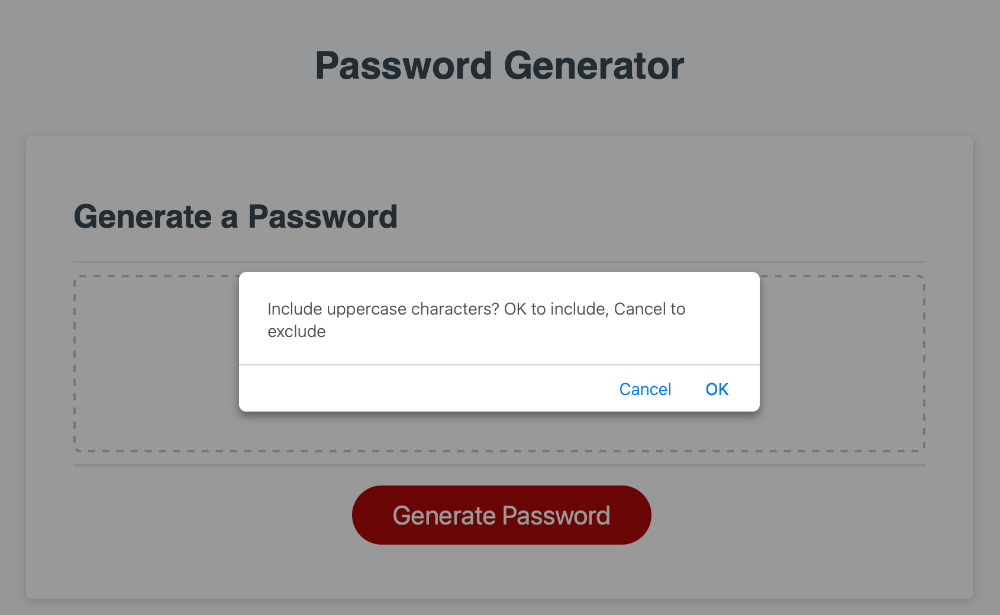
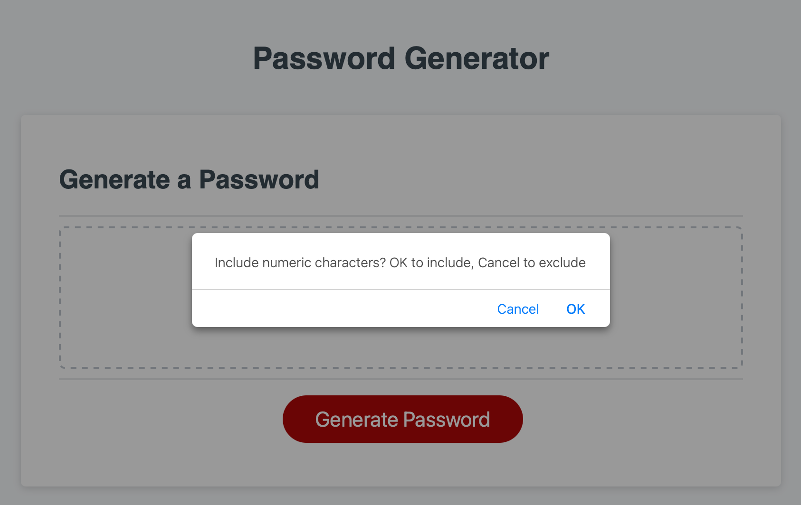
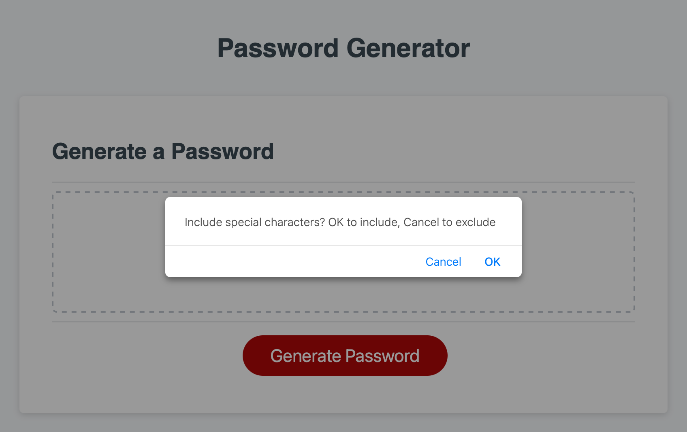

# Week3-Password-Generator


## 03 JavaScript: Password Generator

This week's Challenge requires you to modify starter code to create an application that enables employees to generate random passwords based on criteria that they’ve selected. This app will run in the browser and will feature dynamically updated HTML and CSS powered by JavaScript code that you write. It will have a clean and polished, responsive user interface that adapts to multiple screen sizes.


```
AS AN employee with access to sensitive data
I WANT to randomly generate a password that meets certain criteria
SO THAT I can create a strong password that provides greater security
```

## Acceptance Criteria

```
GIVEN I need a new, secure password
WHEN I click the button to generate a password
THEN I am presented with a series of prompts for password criteria
WHEN prompted for password criteria
THEN I select which criteria to include in the password
WHEN prompted for the length of the password
THEN I choose a length of at least 8 characters and no more than 128 characters
WHEN asked for character types to include in the password
THEN I confirm whether or not to include lowercase, uppercase, numeric, and/or special characters
WHEN I answer each prompt
THEN my input should be validated and at least one character type should be selected
WHEN all prompts are answered
THEN a password is generated that matches the selected criteria
WHEN the password is generated
THEN the password is either displayed in an alert or written to the page
```


## Usage

open index.html in Google Chrome (recommended), the password generator is shown as below:


On pressing the button "Generate Password", 

it first promopts the user to "Enter password length (between 8 and 128 characters):"


then prompts the user to "Include lowercase characters? OK to include, Cancel to exclude"


then prompts the user to "Include uppercase characters? OK to include, Cancel to exclude"



then prompts the user to "Include numeric characters? OK to include, Cancel to exclude" 



finally prompts the user to "Include special characters? OK to include, Cancel to exclude"



after all validations have been passed, a password is generated and displayed on the text panel.


User can click button "Generate Password" to generate another password.


## Features

it includes the following features:

1.  length of password within 8 and 128 in length. 
2.  at least one character type to be included for password
3.  password can be regenerated by clicking on "Generate Password" button again.
4.  At least one character type for each type in the password if included.


## Tests

Testing done on:

1. testing on non-numeric password length.


## Resources

Link to Deployed Website:
https://percivalho.github.io/Week3-Password-Generator/

Link to GitHub repo:
https://github.com/percivalho/Week3-Password-Generator.git


## License 


## Credits and Copyright 
© Copyright 2023 - Present. Percival Ho